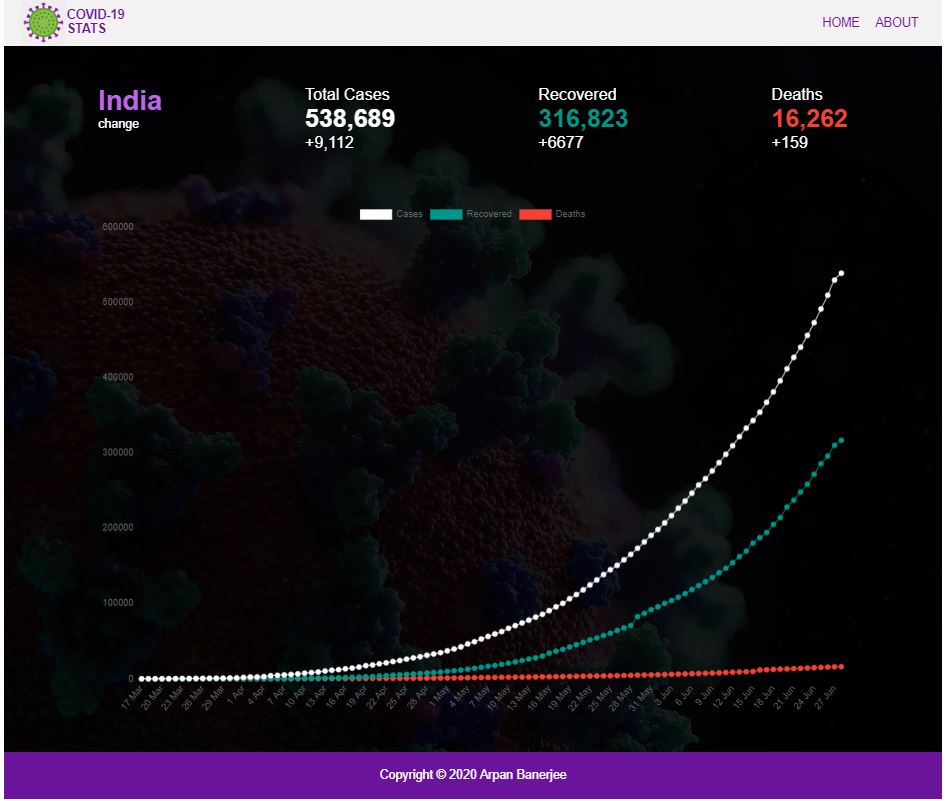

# COVID-19_TRACKER_HTML_CSS_JAVASCRIPT
COVID-19 with HTML5, CSS3 and JavaScript
It displays the Total number of cases, recovered and deaths along with new changes for each of the categories.

#### Api used--
1. geolocator -to detect user's country based on the ip address.
2. `https://covid19-monitor-pro.p.rapidapi.com/coronavirus/cases_by_days_by_country.php?country=${user_country}` to get the Covid19 data for each country.

